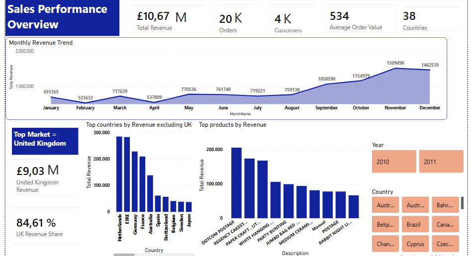
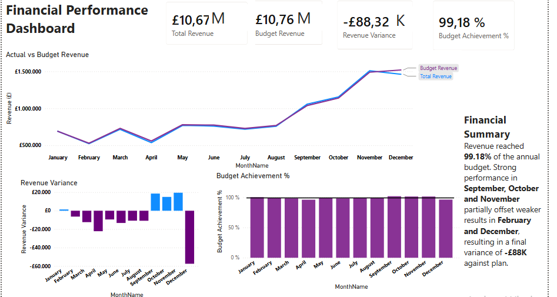
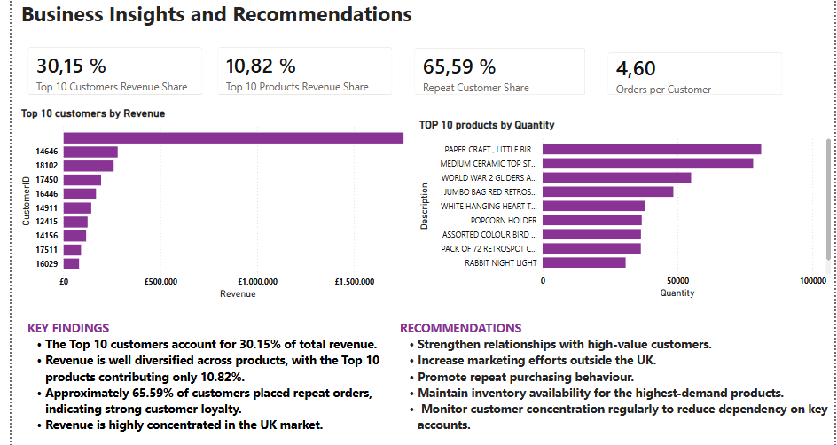

# Online Retail Business Intelligence Dashboard

An end-to-end Business Intelligence project that transforms raw transactional data into actionable business insights using **MySQL, SQL, Power BI, and DAX**.

The project simulates a real-world BI workflow, covering data ingestion, cleaning, transformation, financial planning, dashboard development, and business analysis.

---

# Project Overview

This project analyzes over **541,000 online retail transactions** to evaluate sales performance, customer behavior, product performance, and financial results.

To simulate a realistic FP&A environment, a separate **Budget dataset** was integrated, allowing Actual vs. Budget analysis and variance reporting.

---

# Business Objectives

The dashboard was designed to answer key business questions such as:

- How is the business performing overall?
- Are sales meeting budget expectations?
- Which customers generate the highest revenue?
- Which products drive sales volume?
- What business insights can support decision-making?

---

# Technology Stack

- **MySQL**
- **SQL**
- **Power BI**
- **DAX**
- **Microsoft Excel**

---

# ETL Process

## 1. Data Import

- Imported the Online Retail dataset into MySQL.
- Loaded more than **541,000 transaction records**.

## 2. Data Quality Assessment

Performed several validation checks, including:

- Missing Customer IDs
- Cancelled invoices
- Negative quantities
- Zero prices
- Duplicate records
- Country validation

## 3. Data Cleaning & Transformation

Created a clean analytical table by:

- Converting Unit Price into numeric format
- Creating Revenue calculations
- Converting Invoice Date to DATETIME
- Preparing data for reporting

## 4. SQL Analytical Views

Created reusable SQL views to simplify reporting in Power BI.

---

# Power BI Data Model

The project combines multiple data sources:

- Sales transactions (MySQL)
- Budget dataset (CSV)

The model enables:

- Budget vs Actual analysis
- Variance calculations
- Financial KPIs
- Customer insights
- Product analytics

---

# DAX Measures

Examples include:

- Total Revenue
- Orders
- Customers
- Average Order Value
- Budget Revenue
- Revenue Variance
- Budget Achievement %
- Average Revenue per Customer
- Repeat Customer Share
- Top 10 Customer Revenue Share
- Top 10 Product Revenue Share

---

# 📑 Dashboard Pages

## Sales Performance Overview

Provides a high-level view of business performance.

Features:

- Executive KPIs
- Monthly Revenue Trend
- Top Countries
- Top Products
- Market Analysis
- Interactive Filters

---

## Financial Performance

Simulates an FP&A reporting environment.

Features:

- Actual vs Budget
- Revenue Variance
- Budget Achievement
- Financial Summary

---

## Business Insights

Transforms data into business recommendations.

Includes:

- Customer Analysis
- Product Analysis
- Customer Retention
- Key Findings
- Strategic Recommendations

---

# Key Business Insights

Some of the main findings include:

- Revenue reached approximately **99%** of the annual budget.
- Revenue is highly concentrated in the UK market.
- Approximately **66%** of customers placed repeat orders.
- The Top 10 customers generated around **30%** of total revenue.
- Product revenue is well diversified across the catalog.

---

# Repository Structure

```
online-retail-bi-dashboard/
│
├── data/
├── sql/
├── powerbi/
├── screenshots/
├── README.md
└── LICENSE
```

---

# Skills Demonstrated

- SQL Data Cleaning
- ETL
- Data Modeling
- Power BI Development
- DAX
- Business Intelligence
- Financial Planning & Analysis (FP&A)
- Dashboard Design
- KPI Development
- Business Analysis
- Data Visualization

---

# Dashboard Preview

### Sales Performance Overview


Provides a high-level overview of sales performance, customer activity, product performance, and geographic distribution.

### Financial Performance


Compares actual sales against budget, highlighting monthly variances and overall financial performance.

### Business Insights


Summarizes customer behavior, product performance, and strategic recommendations derived from the analysis.

---

# Contact

Feel free to connect with me on LinkedIn or explore my other Business Intelligence projects on GitHub.
